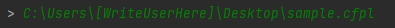

# CIT Programming Language Interpreter

A Programming Language Course Project: CFPL Interpreter (Early Version)

## Files

    @CFPL_grammar - BNF Grammar for CFPL explained here
    **CFPL** - Where the main code for Lexer, Parser and Interpreter
    **shell** - Where you run and test CFPL Programs

    **sample programs**: 
        * sample.cfpl
        * sample2.cfpl
        * factorial.cfpl
    
    

## How to Run the Code

    1. Run **shell.py**
    2. Type where the file of program your going to run for the interpreter.
        Example:
        
        or typing the example program here
        
